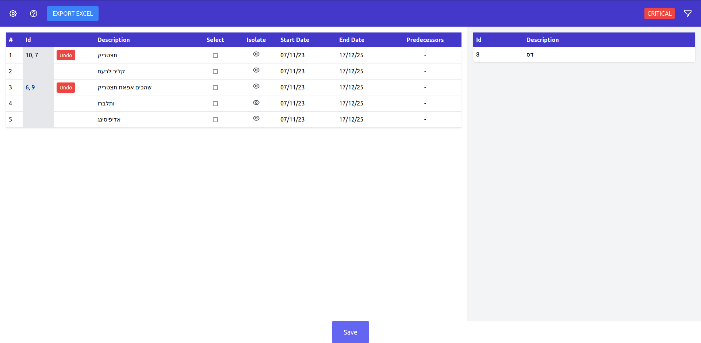

# Table Drag'n'Drop

## Project Requirements

1. Node v18+

## Project Setup

1. `git clone https://github.com/lehcode/table-drag-n-drop.git`
2. `cd table-drag-n-drop`
3. Install yarn for best NX support `npm install --global yarn@latest`
4. Run `yarn install` to install dependencies.
5. Run `yarn start-all` to run both projects in parallel.

### Once completed

Frontend is available at `http://localhost:4200`
Backend is available at `http://localhost:3000`

- Use DevTools to reset `localStorage`; this will reset tables.
- Although POST to backend exists and succeeds upon save, it is processed by the simplest controller & service using service class variable to store data.
- Saved changes cannot be undone.
